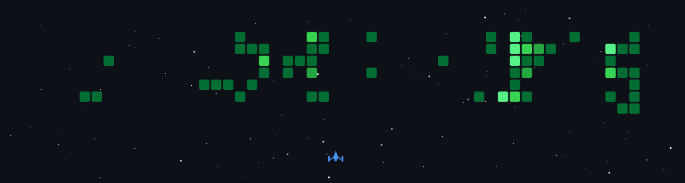

## About Me

Bioinformatics specialist based in İzmir, Turkey. I build and automate genomics pipelines — WES/WGS variant calling, microbiome analysis, and beyond. I work across workflow engines (Nextflow, Snakemake, WDL, CWL) and develop high-performance bioinformatics tools in Python and Rust.

## Workflow Engines

## AI Tools

## Languages

  

## ML & Data Science

## Tools & Platforms

  

  

## Connect

  

  

Contribution graph turned into an arcade game — generated daily via GitHub Actions.
